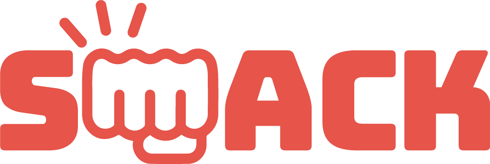

[Smack live][heroku]

[heroku]: http://www.smackchat.online

Smack is a full-stack browser application inspired by Slack and built for the gaming community. It utilizes Ruby on Rails and a PostgreSQL database for the back-end and React/Redux for the front-end.


## Features and Implementation

### Channels & Text-Channels

Smack makes it easy to talk to different groups through personalized `channels`, which are assigned to `users`. Owned channels are created under users and each possess a single `admin_id` that refer to the creator.

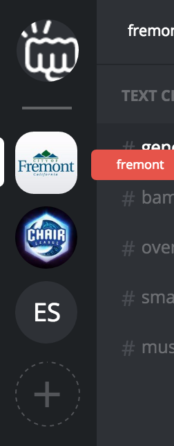

Users who create their own channel, as admins, can invite as well as remove other users from their channel. New users are added to a channel through a `subscription` object, which has foreign keys linking a single user to a single channel.

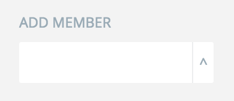

Each channel has unique `text_channels`, which allow users to compartmentalize separate discussions within the same group.

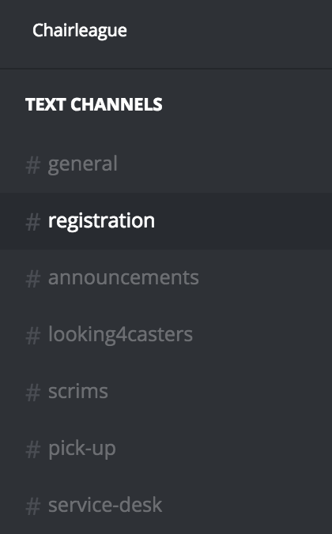

Admins can add and remove text-channels as well as edit each text-channel's description.

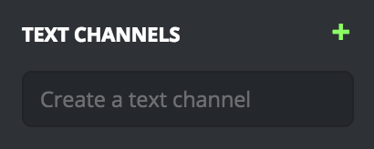
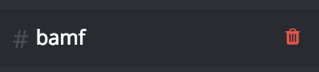
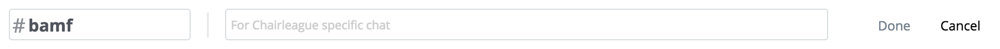

### Direct-Messages

Direct messaging is personal to each individual through their `me_channel`, which is located in the top left for all users. Each `direct_message` is a reference to two users in the database.

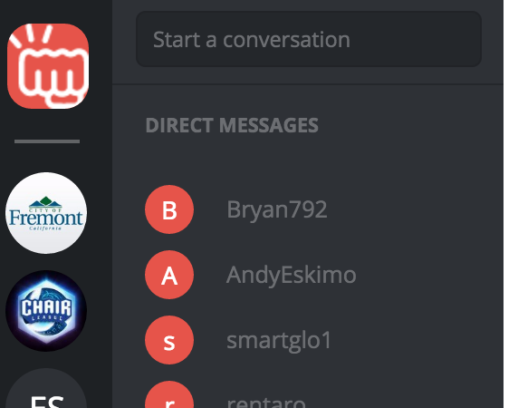

Users can add each other to begin one-on-one conversations.

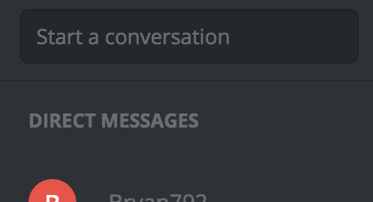

Previous direct messages are listed for easy-access on future occasions.

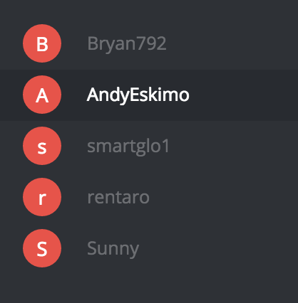

### Live Chat

Both text-channels and direct-messages feature live chat functionality enabled through Pusher, allowing users to chat in real-time.

When users are in a particular text-channel or direct-message chat, they are subscribed to that chat's Pusher "channel".

```javascript
let channel = window.pusher.subscribe('text_channel_' + this.props.params.id[1]);
```

Each Pusher channel is bound to message posted, message updated, and message destroyed events.

```javascript
channel.bind('message_posted', data => {
  this.props.fetchOneDirectMessage(this.props.directMessage.id);
});
channel.bind('message_updated', data => {
  this.props.fetchOneDirectMessage(this.props.directMessage.id);
});
channel.bind('message_destroyed', data => {
  this.props.fetchOneDirectMessage(this.props.directMessage.id);
});
```

Automatic scroll-down for each chat-box using jQuery combined with React's lifecycle methods makes for easy-to-manage chat boxes.

```javascript
componentDidUpdate () {
  let objDiv = document.getElementById("scrollBottom");
  objDiv.scrollTop = objDiv.scrollHeight;
}

componentDidMount () {
  let objDiv = document.getElementById("scrollBottom");
  objDiv.scrollTop = objDiv.scrollHeight;
}
```

### Messages

`Messages` are pulled along with each individual text-channel and direct-message when retrieved from the database. The message model was implemented with polymorphism because messages have the same functionality regardless of its location in the application.

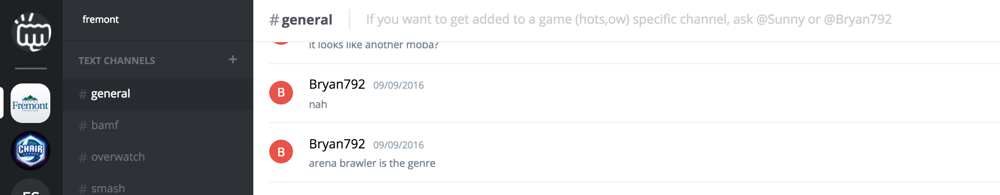

Messages can be easily created, edited, and deleted.

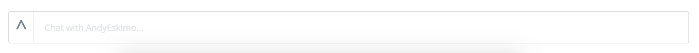
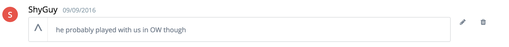

### Single-Page

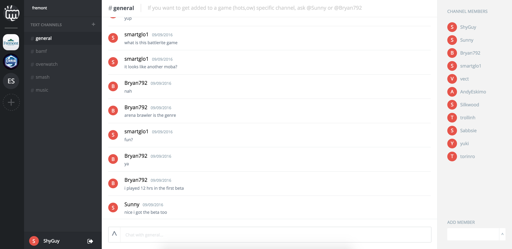

Smack is a one-page app and allows for quick navigation through its various components. Each main component, `channel_nav`, `text_channel_nav`, `direct_messages`, and `text_chat_box` is populated with information from the Rails database and rendered only when necessary.

## Future Development

### Voice Chat

Voice chat has become an important part of the online gaming experience. To implement this, Smack's database would need another model a la the existing text-channel model. These voice-channels would be assigned a key referring to each channel and would be pulled from the Rails database along with text-channels.

### Responsive Search

Response Search would make Smack a lot more user friendly when it comes to starting a new direct message. This would involve an AJAX query to grab users subscribed to one's own subscribed channels, meaning one would have to add a new user to their channel first. This makes sense because of Smack's emphasis on channels and group interaction.

### Adding Users

Adding users can be improved through the use of links or pass-codes. Channel Admins would generate a link or a passcode that they can pass to a new user in order to subscribe them to their owned channel.
